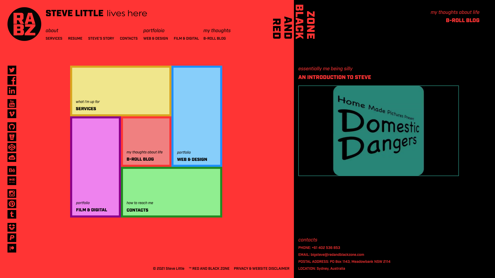
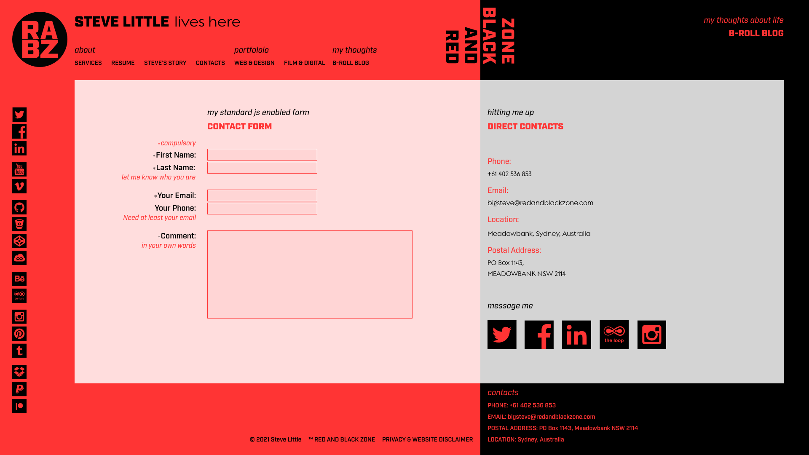

# redandblackzone.com

This is the main website portfolio of Steve Little (there's always something to improve).

Live website https://redandblackzone.com.

## Major Additions

- [x] Update the Resume page [#3](https://github.com/RedAndBlackZone/redandblackzone/issues/3)
- [x] Update the Graphic and Web Design Pages [#12](https://github.com/RedAndBlackZone/redandblackzone/issues/12)
- [ ] Implement a Popup Message With Link to Github [#14](https://github.com/RedAndBlackZone/redandblackzone/issues/14)
- [ ] Redesign CMS Page to Incorporate 2 Additional Examples of Work [#1](https://github.com/RedAndBlackZone/redandblackzone/issues/1)
- [ ] Redesign the Front End Page to Include the Latest Version of the Sports Warehouse Website [#2](https://github.com/RedAndBlackZone/redandblackzone/issues/2)
- [ ] Update the Services Page [#4](https://github.com/RedAndBlackZone/redandblackzone/issues/4)
- [ ] Improve the Mobile/Tablet Design [#15](https://github.com/RedAndBlackZone/redandblackzone/issues/15)
- [ ] Improve the Accessibility According to WCAG and Aria Standards [#16](https://github.com/RedAndBlackZone/redandblackzone/issues/16)
- [ ] Re-Organise the B-ROLL BLOG [#5](https://github.com/RedAndBlackZone/redandblackzone/issues/5)
- [ ] Redesign the Coloured Section Menus [#11](https://github.com/RedAndBlackZone/redandblackzone/issues/11)
- [ ] Review the Wording of the Privacy-Disclaimer Page [#27](https://github.com/RedAndBlackZone/redandblackzone/issues/27)

## Fixes

- [x] Fix Unsanitised HTML Output in Contact Form Confirmation [#28](https://github.com/RedAndBlackZone/redandblackzone/issues/28)
- [x] Correct 'contactFormProcessing.php' File Location for Contact Form [#29](https://github.com/RedAndBlackZone/redandblackzone/issues/29)
- [x] Check Through for Grammar and Spelling [#6](https://github.com/RedAndBlackZone/redandblackzone/issues/6)
- [ ] Upgrade the Confirmation Page for the Site Contact Form [#17](https://github.com/RedAndBlackZone/redandblackzone/issues/17)
- [ ] Correct the Left Section Left Margin on the Editing and Screenwriting Pages [#18](https://github.com/RedAndBlackZone/redandblackzone/issues/18)
- [ ] Create a Portfolio Landing Page [#19](https://github.com/RedAndBlackZone/redandblackzone/issues/19)
- [ ] Fix the Vertical RED AND BLACK ZONE Heading on Mac Devices [#7](https://github.com/RedAndBlackZone/redandblackzone/issues/7)
- [x] Add a Site Favicon [#8](https://github.com/RedAndBlackZone/redandblackzone/issues/8)
- [ ] Re-Organise and Combine the 'desktop-landscape' and 'mobile-portrait' Style Sheets [#10](https://github.com/RedAndBlackZone/redandblackzone/issues/10)
- [ ] Add Description Meta Tags to All Pages [#21](https://github.com/RedAndBlackZone/redandblackzone/issues/21)
- [x] Add Hotjar Tracking Code to All Pages [#25](https://github.com/RedAndBlackZone/redandblackzone/issues/25)
- [x] Add Google Tag to All Pages [#32](https://github.com/RedAndBlackZone/redandblackzone/issues/25)

## Original Design Prototype

